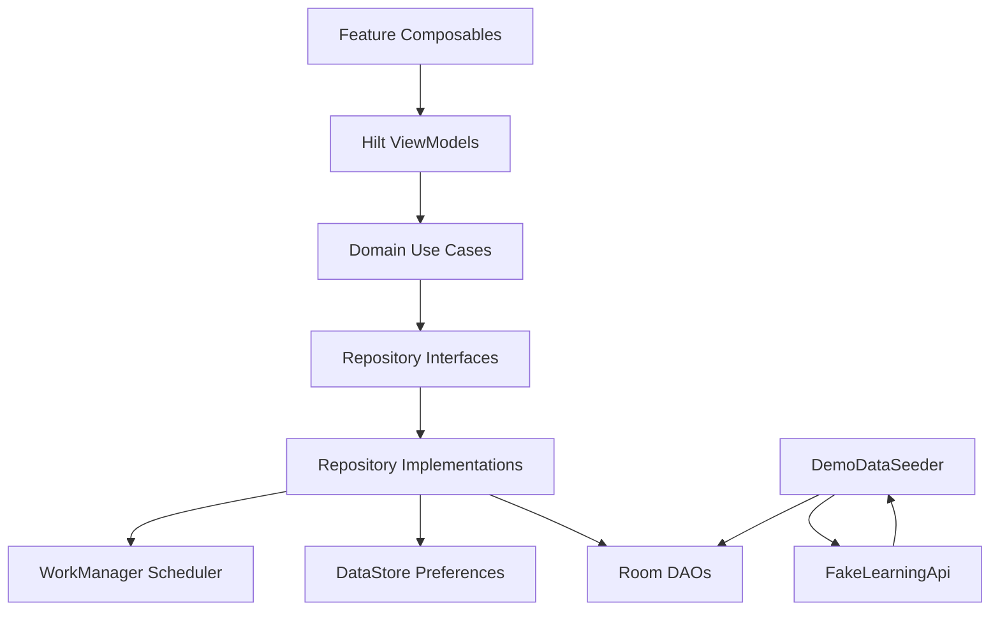

# Architecture

DevJourney uses a pragmatic clean architecture style for a single-module Android app. The goal is to keep UI, domain logic, persistence, fake network data, and platform integrations independent enough to test and evolve.

## Layer Overview

## Core Packages

- `core/common`: shared UI state and common primitives.
- `core/database`: Room database, entities, DAOs, and converters.
- `core/datastore`: DataStore preferences data source.
- `core/designsystem`: Material 3 theme and reusable Compose components.
- `core/navigation`: app shell, drawer, bottom navigation, and route definitions.
- `core/network`: deterministic fake API and demo catalog.
- `core/notification`: WorkManager reminder worker and scheduler.

## Data Packages

Each data package owns the implementation details for one feature area:

- `data/roadmap`
- `data/topic`
- `data/progress`
- `data/notes`
- `data/goals`
- `data/challenges`
- `data/resources`
- `data/analytics`
- `data/settings`

Repository implementations depend on DAOs, DataStore, fake APIs, or schedulers. They return domain models rather than database entities.

## Domain Packages

The domain layer is intentionally small:

- `domain/model`: app models and enums.
- `domain/repository`: contracts consumed by use cases.
- `domain/usecase`: feature-specific actions and observable streams.

Use cases keep feature logic out of composables and make testing easier with fake repositories.

## Feature Packages

Each feature owns its screen and ViewModel:

- `feature/roadmap`
- `feature/topicdetail`
- `feature/notes`
- `feature/goals`
- `feature/challenges`
- `feature/resources`
- `feature/search`
- `feature/analytics`
- `feature/settings`

Composables receive state and callbacks. ViewModels expose immutable `StateFlow` and one-time effects through shared flows.

## State Flow Pattern

The common ViewModel shape is:

1. Observe one or more use cases.
2. Combine or transform flows into a feature-specific UI state.
3. Start with an explicit loading state.
4. Catch errors and emit a user-friendly error state.
5. Send one-time snackbar effects through a `SharedFlow`.

UI collects state with `collectAsStateWithLifecycle`.

## Dependency Injection

Hilt modules live in `di/`:

- Database and DAO providers.
- Repository bindings.
- Fake network binding.
- Coroutine dispatcher and application scope providers.

The app uses constructor injection for repositories, use cases, ViewModels, workers, data sources, and schedulers.

## Offline-First Behavior

`DevJourneyApp` launches `DemoDataSeeder` on startup. The seeder calls `FakeLearningApi` and writes the full catalog to Room only when the database is empty. From that point, the app reads and writes local state through repositories.

Settings are separate from Room because they are user preferences rather than relational learning data. They are stored in DataStore and observed at the application shell so theme changes apply app-wide.
