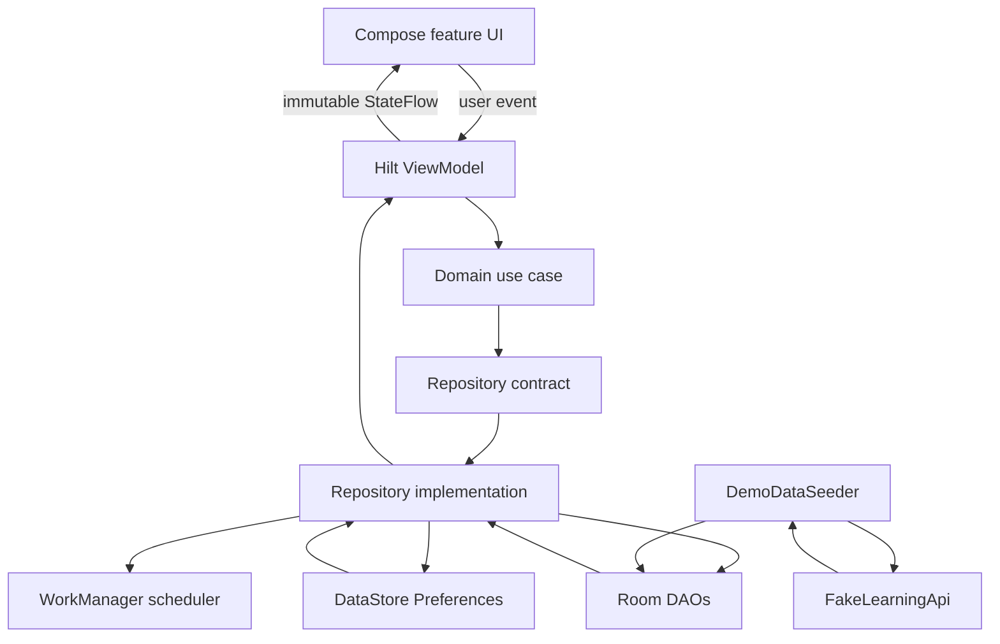

# Architecture

DevJourney is a single-module Android application organized with MVVM and clean architecture inspired layers. The boundaries are deliberately practical: enough separation to make features testable and replaceable without adding module or abstraction overhead that the current app does not need.

## Overall Data Flow

```text
Compose UI
   | user action
   v
ViewModel
   |
   v
Use case
   |
   v
Repository interface
   |
   v
Repository implementation
   |
   +--> Room DAO
   +--> DataStore
   +--> Fake API
   +--> WorkManager scheduler
   |
   v
Flow / domain model
   |
   v
ViewModel StateFlow
   |
   v
Compose UI
```



## UI Layer

Feature composables live under `feature/`. Route composables obtain a Hilt ViewModel, collect state with `collectAsStateWithLifecycle`, collect one-time effects where needed, and pass plain values/callbacks into screen composables.

The design system under `core/designsystem` supplies reusable Material 3 cards, badges, search input, chip groups, feedback states, theme, colors, and typography.

Business rules do not live in composables. UI code formats domain/UI state, renders it, and forwards user intent.

The Dashboard is an exception in data maturity, not architecture: it is a static Compose preview shell and does not yet own a ViewModel or repository-backed aggregation.

## ViewModel Layer

Feature ViewModels are annotated with `@HiltViewModel` and use constructor injection. Their responsibilities are to:

- Observe use-case flows.
- Combine search/filter/editor state with repository data.
- Derive feature-specific immutable UI state.
- Launch suspend actions in `viewModelScope`.
- Convert failures into an error message.
- Emit one-time effects for transient feedback.

Most streams use `stateIn(viewModelScope, SharingStarted.WhileSubscribed(5_000), initialState)` so subscribers receive a `StateFlow` with a defined loading state.

Examples:

- `RoadmapsViewModel` combines roadmaps, search query, and category selection.
- `SearchViewModel` debounces input for 300 ms and switches to the latest search flow.
- `NotesViewModel` owns search and editor state while use cases own CRUD behavior.
- `MainViewModel` observes DataStore-backed settings for app-wide theming.

## Domain And Use-Case Layer

`domain/model` contains Kotlin models and enums used by features. `domain/repository` defines contracts without Room, DataStore, or WorkManager types. `domain/usecase` exposes focused operations such as observing roadmaps, marking a topic complete, creating a note, bookmarking a resource, searching everything, or updating theme settings.

This layer gives ViewModels intention-revealing APIs and makes use cases testable with fake repositories.

## Repository Layer

Repository interfaces are defined in the domain layer; implementations live under `data/`. They:

- Subscribe to DAO flows.
- Combine progress and bookmark data where necessary.
- Map entities into domain models.
- Perform local writes for completion, notes, goals, challenges, and bookmarks.
- Delegate settings writes to DataStore.
- Delegate reminder enable/disable work to `LearningReminderScheduler`.

Room entities are not exposed to ViewModels or composables.

## Data Layer And Model Separation

The app has four conceptual model shapes:

1. DTOs from the fake API.
2. Room entities for local storage.
3. Domain models used by repositories and use cases.
4. Feature UI state classes used by ViewModels and composables.

DTO-to-entity and entity-to-domain mappers keep schema concerns from leaking into UI behavior. UI state may include loading flags, selected filters, editor state, or error text that do not belong in domain models.

## Room Database

`DevJourneyDatabase` contains eight entities:

- Roadmaps
- Topics
- Progress
- Notes
- Goals
- Challenges
- Resources
- Bookmarks

DAOs expose important collections as `Flow`, allowing updates to propagate automatically. The database is version 1 and exports its schema under `app/schemas`.

Progress and bookmark state are separate tables so roadmap/topic/resource models can be rebuilt reactively without storing calculated values in the catalog tables.

## DataStore

`UserPreferencesDataSource` uses Preferences DataStore for:

- Theme preference.
- Dynamic color.
- Reminder enabled.
- Selected roadmap id.
- First-launch state.

`DataStoreSettingsRepository` is the only settings repository bound by Hilt. Composables never read DataStore directly. `MainActivity` observes `MainViewModel.settings` and chooses system, light, or dark theme before rendering the app shell.

## Fake Network And Demo Seeding

`InMemoryFakeLearningApi` returns `DemoLearningCatalog` after a short delay. `DemoDataSeeder` checks `RoadmapDao.countRoadmaps()` at application startup. If the database is empty, it maps all DTOs and inserts them inside a Room transaction.

This is fake synchronization rather than a full sync engine: there are no remote ids, conflict rules, retries, pagination, authentication, or upload queue.

## WorkManager And Reminders

`LearningReminderScheduler` enqueues unique daily periodic work or cancels it when the setting is disabled. `LearningReminderWorker` currently returns `Result.success()` and does not create a notification channel or post a visible notification. The scheduling boundary exists; visible reminder delivery remains future work.

## Navigation Structure

`DevJourneyAppShell` owns the Material 3 scaffold, top app bar, modal drawer, bottom navigation, and `NavHostController`.

Bottom destinations:

- Dashboard
- Roadmaps
- Challenges
- Analytics
- Settings

Drawer destinations additionally expose Notes, Goals, Resources, Search, and About. Roadmap and topic details use string route arguments. Navigation helpers centralize single-top behavior and detail-route construction.

## State Management

State is unidirectional:

1. Repositories emit data.
2. Use cases expose or transform repository operations.
3. ViewModels combine data with local interaction state.
4. Compose renders immutable UI state.
5. User actions call ViewModel functions.

Search/filter inputs use `MutableStateFlow` inside ViewModels. Public state is exposed as `StateFlow`, not as mutable streams.

## One-Time Effects

Feature actions that need transient feedback use sealed effect interfaces and `MutableSharedFlow`, then expose `asSharedFlow()`. Route composables collect effects in `LaunchedEffect` and show snackbars.

This pattern is used by roadmap/topic updates, notes, goals, challenges, resources, and settings. Search and Analytics do not emit one-time effects because they currently have no transient action feedback.

## Loading, Empty, Success, And Error States

Feature UI state usually begins with `isLoading = true`. Flow transformations emit loaded content, `catch` converts failures into `errorMessage`, and computed properties such as `isEmpty` distinguish a successful empty result from loading or failure.

Reusable `LoadingState`, `EmptyState`, and `ErrorState` composables keep feedback consistent.

## Dependency Injection

Hilt provides:

- `DevJourneyDatabase` and all DAOs.
- `FakeLearningApi` implementation.
- Repository interface bindings.
- IO dispatcher and application coroutine scope.
- Constructor-injected use cases, ViewModels, DataStore data source, and reminder scheduler.

`DevJourneyApp` is annotated with `@HiltAndroidApp`; `MainActivity` is an `@AndroidEntryPoint`.

## Scaling Direction

The current package boundaries can become Gradle modules when build time or team ownership justifies it. A likely path is `core:database`, `core:designsystem`, `core:network`, `domain`, `data`, and one module per major feature. The repository contracts already reduce the cost of that move.
