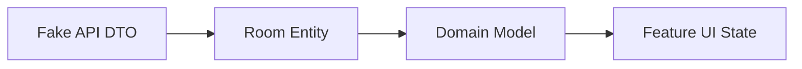

# Data Model

DevJourney separates database entities from domain models. Room entities model local storage. Domain models model the behavior consumed by use cases and feature UI.

## Room Entities

| Entity | Table | Purpose |
| --- | --- | --- |
| `RoadmapEntity` | `roadmaps` | Learning tracks such as Android Developer, Backend Developer, AI Engineer, and System Design. |
| `TopicEntity` | `topics` | Roadmap topics grouped by section and ordered for path display. |
| `ProgressEntity` | `progress` | Topic completion state and timestamps. |
| `NoteEntity` | `notes` | User notes, optionally attached to a topic. |
| `GoalEntity` | `goals` | Daily, weekly, and monthly learning goals. |
| `ChallengeEntity` | `challenges` | Coding challenges with status and solution notes. |
| `ResourceEntity` | `resources` | Articles, videos, documentation, courses, and tools. |
| `BookmarkEntity` | `bookmarks` | Topic and resource bookmarks. |

## Domain Models

| Model | Purpose |
| --- | --- |
| `Roadmap` | Roadmap summary with calculated completion percentage. |
| `RoadmapDetails` | Roadmap plus sectioned topics. |
| `RoadmapSection` | Section title, topics, and section completion percentage. |
| `Topic` | Learning topic with completion and bookmark state. |
| `TopicProgress` | Completion history for analytics and progress screens. |
| `Note` | User-authored note. |
| `LearningGoal` | Goal state and cadence. |
| `CodingChallenge` | Challenge state, difficulty, and solution notes. |
| `LearningResource` | Resource metadata and bookmark state. |
| `LearningAnalytics` | Aggregated learning metrics. |
| `UserSettings` | DataStore-backed app preferences. |

## Mapping Flow

DTOs are only used during demo catalog sync. Room entities are local persistence details. Domain models are used by use cases and ViewModels.

## Bookmarks

Bookmarks are stored in a shared table using `targetId` and `targetType`. This keeps topic and resource bookmarking consistent while allowing feature-specific repositories to expose simple Boolean flags in domain models.

## Progress

Topic progress is keyed by topic id. Completion writes update:

- `isCompleted`
- `completedAt`
- `lastUpdatedAt`

Analytics uses completion timestamps to calculate streaks, weekly totals, monthly totals, and completion rate.

## Settings

Settings are not stored in Room. DataStore owns:

- Theme preference.
- Dynamic color enabled.
- Daily reminder enabled.
- Selected roadmap id.
- First launch state.

The UI observes settings through `SettingsRepository` and use cases.
